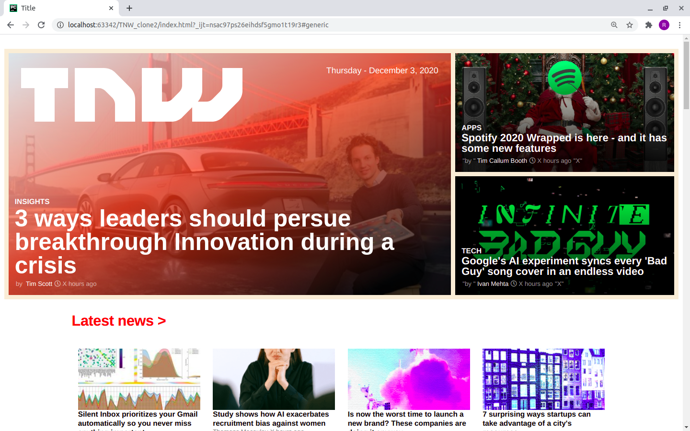

# THE NEXT WEB-CLone
This project is a clone of a thenextweb.com website. The page is responsive

# Getting started :
this website can be viewd better on the screen size of of 1920 X 1080 in Mozilla firefox browser.
you can also download the repo and open the ''index.html" file with Mozilla Firefox.

The purpose of these project it to create a similar looking website of thenexweb.com  using html and css

## BUILT WITH

    -HTML
    -CSS
    -scss

## LIVE DEMO

[Live Demo Link](https://github.com/RokoVarano/TNW_clone2)

##  AUTHORS

👤 **Author1**

- GitHub: [@githubhandle](https://github.com/widzthedvloper)
- Twitter: [@twitterhandle](https://twitter.com/widzthedvloper)
- LinkedIn: [LinkedIn](https://www.linkedin.com/in/widzmarc-jean-nesly-phelle-252a26129/)

👤 **Author2**

- GitHub: [@githubhandle](https://github.com/RokoVarano)
- Twitter: [@twitterhandle](https://twitter.com/RodrigoIbacet11)
- LinkedIn: [LinkedIn](https://www.linkedin.com/in/rodrigo-ibaceta-a8657611a/)

## SHOW YOUR SUPPORT
Give a * if you like the project

## 📝 LICENSE
This project as no license
